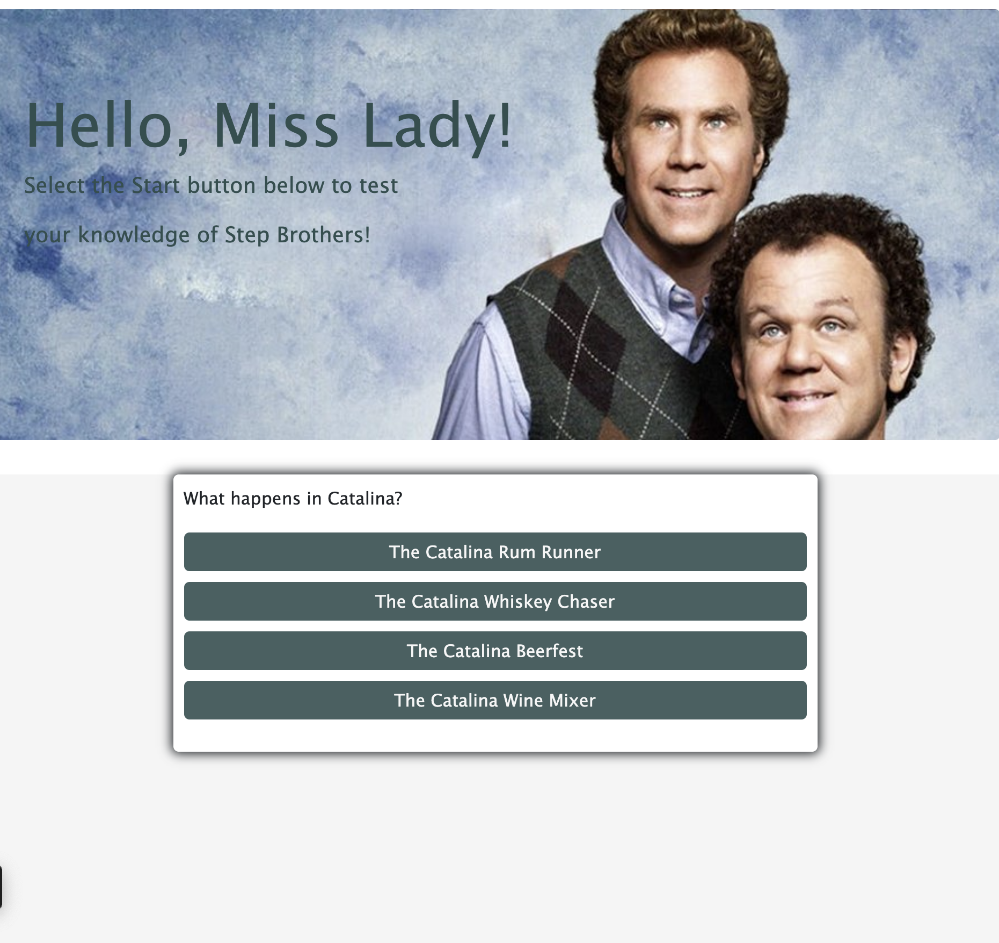

# code-quiz

This is a homework assignment for Case Western Reserve University Coding Bootcamp. The purpose of this assignment is to make a website that creates a timed quiz using JavaScript.

Links to websites:

https://github.com/michellew179/code-quiz/

https://michellew179.github.io/code-quiz/

Screenshot of website:

